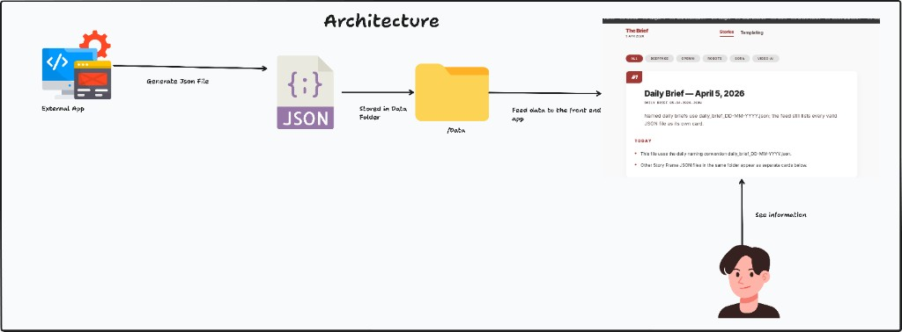
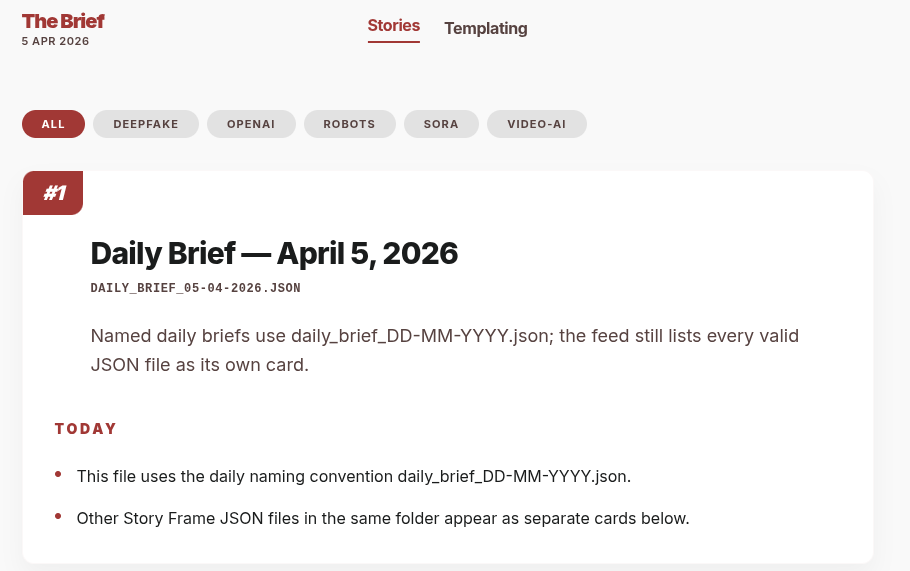
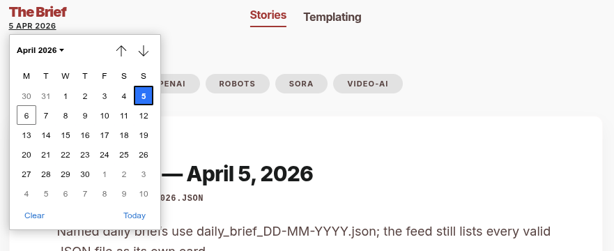
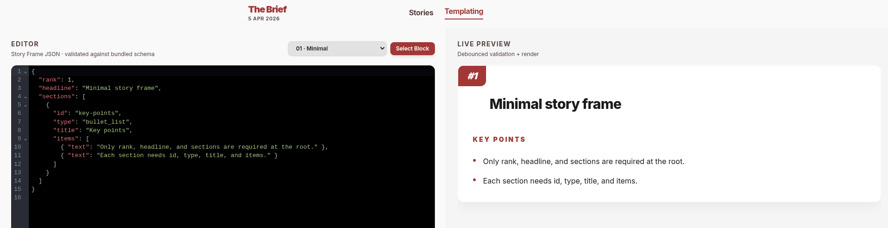
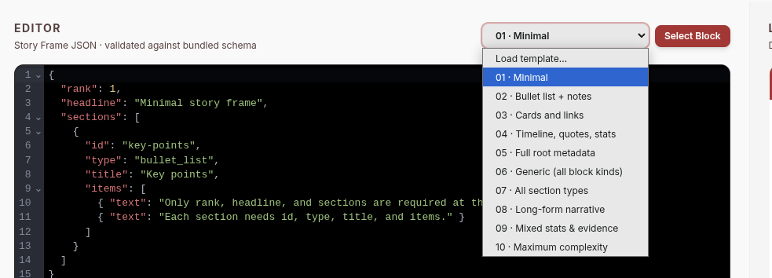
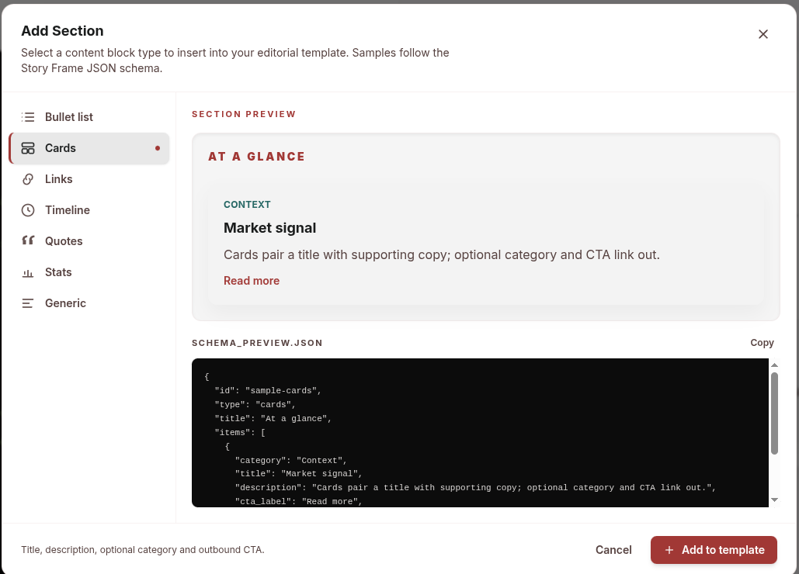

# The Brief

**The Brief** is a single web dashboard that replaces a fragmented morning routine: instead of opening several tools or scripts to see what matters, you open one place and get a consistent, prioritised, editorial-style feed of structured updates. It reads validated JSON “story frames” from a folder on disk (no database in v1), renders a central feed and story views, and includes templating tools so authors can validate JSON before it ever hits `/data`.

**Link to project:** run it locally and open [http://localhost:3000](http://localhost:3000) after `docker compose up` or `npm run dev` from `web/` (see [Quick start](#quick-start)). 
---

## How it’s made

**Tech used:** TypeScript, React 19, Next.js 16 (App Router), Tailwind CSS, AJV (JSON Schema draft 2020-12), Docker.

The app is intentionally **filesystem-first**: producers drop `*.json` Story Frame files into a configured data directory (`BRIEF_DATA_DIR`, default `/data` in Docker or `web/data` in dev). The server loads and validates each file against a shared schema, skips bad files without crashing the page, and sorts stories by `rank`, then filename, then modification time. The UI follows an **Editorial Stream** design system—calm typography, card-based feed, sticky header with date navigation, tag filtering, and a templating page where you paste JSON and get schema errors and a live preview.

Routes that matter today: **Stories** (`/`) for the feed, **Story** (`/s/[filename]`) for the full article, **Templating** (`/templating`) for validate-and-preview. **Archive** and **Insights** are placeholder screens reserved for later persistence and analytics.

**APIs:** `GET /api/briefs` exposes the same ingest shape the server uses for the feed; `POST /api/validate` powers the templating workflow. Full route and env details live in **[web/README.md](web/README.md)**.

### Architecture (at a glance)

End-to-end flow: an external process writes Story Frame JSON into the data folder; the Next.js app reads those files and renders the dashboard.



---

### UI

#### Stories Page
When opening up the app you see the daily stories that have been ingested to the app via external sources/


you can also filter by date 



#### Templating Page
This is where you can generate and review your JSON files to see how it looks before committing. 



There are 10 predefined templates you can use varying in complexity


You also have the ability to add predefined content blocks by clicking on "Select Block"


---

## Optimizations

- **Resilient ingest:** invalid JSON is isolated per file—one bad export does not take down the whole feed; users see ingest notifications instead of a blank app.
- **Validation at the edge of trust:** AJV validates against a single JSON Schema so the UI and APIs agree on what “valid” means.
- **Deployable v1:** Docker Compose builds a reproducible image; data is a mounted volume so you can refresh briefs without rebuilding.
- **Hero image:** the PNG under `docs/readme/assets/` can be re-exported or run through a lossy optimiser (e.g. `pngquant`) if you want a smaller clone for contributors.

---

## Lessons learned

Building a **read-only dashboard** on top of flat files forces clear contracts: the schema and the UX have to stay in sync, and error messaging matters as much as the happy path—especially for template authors who paste half-finished JSON. Shipping **Editorial Stream** consistently across feed, article, and templating views meant leaning on shared components and Tailwind tokens rather than one-off styles. Leaving **Archive / Insights** as honest placeholders kept scope honest for v1 while documenting where the product can grow (persistence, analytics) without pretending those features exist yet.

---

## Repository layout

| Path | Purpose |
|------|---------|
| `web/` | Next.js app — the runnable product. |
| `Documentation_References/` | PRD, UI notes, JSON schema and examples. |
| `docs/readme/assets/` | README images (hero, architecture flow diagram, optional UI screenshots). |

---

## Quick start

**Docker (recommended for production-style runs):** from the repo root:

```bash
docker compose build
docker compose up
```

Then open [http://localhost:3000](http://localhost:3000). Sample data is mounted from `web/data/`; add or replace `*.json` Story Frame files there.

**Local development:**

```bash
cd web && npm install && npm run dev
```

---

## Examples

Add links to **your** other portfolio projects here (same idea as the original template—recruiters skim for breadth):

- *(your project name — GitHub or live demo)*
- *(another project)*

**Further reading in this repo:** [Documentation_References/PRD.md](Documentation_References/PRD.md) · [web/README.md](web/README.md)
